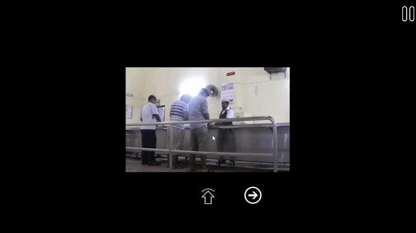
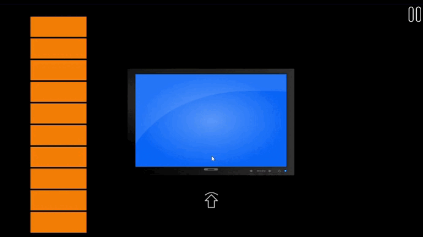
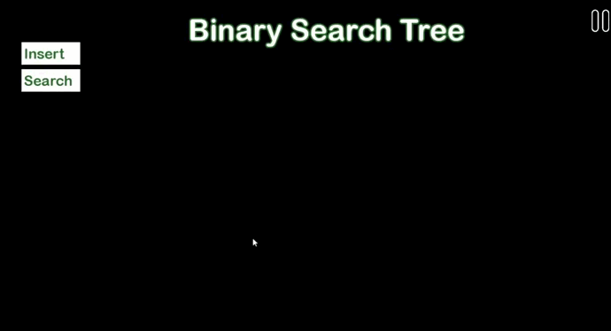

An educational software to observe and comprehend the inner workings of Data Structures within real-world problem-solving contexts.

# Demo
### Stack
A demo browser is implemented by the two stacks approach. It demonstrates how searching and "going back and forth" work in a browser. Another stack will let the user know
their searching history.

### Heap
Heap is implemented via Huffman Coding. User's message will be converted into the Huffman tree. Then the prefix codes of the message will be accessible through a text file.

### Queue
The queue scheduling of a cafe is implemented by Queue. Arrival and departure of the inputs are tracked in the two queue approach.

### Hashtable
Linear probing is displayed in this section. Inputs colliding more than 6 times are abandoned.

### Binary Search Tree
The operations, insert and search of BST are available in version 1.1. Maximum height of the BST can be 5.

